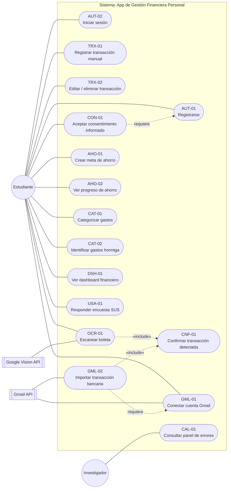

# DIAGRAMA DE CASOS DE USO — APP DE GESTIÓN FINANCIERA PERSONAL

## Código del diagrama

---

## LEYENDA DE NOTACIÓN

| Símbolo | Significado |
|---|---|
|  Círculo | Actor humano (interactúa directamente con la app) |
|  Rectángulo doble | Actor de sistema externo (servicio al que la app se conecta) |
| ⬭ Óvalo (stadium) | Caso de uso |
| Línea sólida | Asociación actor–caso de uso |
| Línea punteada con flecha, «include» | El caso de uso origen ejecuta obligatoriamente al caso de uso destino como parte de su flujo |
| Línea punteada con flecha, "requiere" | Nota de precedencia: el caso de uso origen no puede ejecutarse si el destino no se completó antes (no es una relación UML formal, es una aclaración de dependencia operativa) |

---

## ACTORES

| Actor | Tipo | Descripción |
|---|---|---|
| **Estudiante** | Humano (primario) | Usuario final de la aplicación; participante de la muestra de investigación |
| **Investigador** | Humano (secundario) | Responsable de monitorear la calidad del piloto (consulta errores del sistema) |
| **Google Vision API** | Sistema externo | Servicio de OCR que procesa las imágenes de boletas y devuelve el texto/monto detectado |
| **Gmail API** | Sistema externo | Servicio de Google que permite leer, mediante OAuth 2.0, las notificaciones bancarias del correo del estudiante |

---

## CASOS DE USO Y TRAZABILIDAD

| Código UC | Nombre | Actor(es) | HU de origen |
|---|---|---|---|
| UC-AUT-01 | Registrarse | Estudiante | AUT-01 |
| UC-AUT-02 | Iniciar sesión | Estudiante | AUT-02 |
| UC-TRX-01 | Registrar transacción manual | Estudiante | TRX-01 |
| UC-TRX-02 | Editar / eliminar transacción | Estudiante | TRX-02 |
| UC-OCR-01 | Escanear boleta | Estudiante, Google Vision API | OCR-01 |
| UC-CNF-01 | Confirmar transacción detectada | (incluido por UC-OCR-01 y UC-GML-02) | CNF-01 |
| UC-GML-01 | Conectar cuenta Gmail | Estudiante, Gmail API | GML-01 |
| UC-GML-02 | Importar transacción bancaria | Gmail API | GML-02 |
| UC-AHO-01 | Crear meta de ahorro | Estudiante | AHO-01 |
| UC-AHO-02 | Ver progreso de ahorro | Estudiante | AHO-02 |
| UC-CAT-01 | Categorizar gastos | Estudiante | CAT-01 |
| UC-CAT-02 | Identificar gastos hormiga | Estudiante | CAT-02 |
| UC-DSH-01 | Ver dashboard financiero | Estudiante | DSH-01 |
| UC-USA-01 | Responder encuesta SUS | Estudiante | USA-01 |
| UC-CAL-01 | Consultar panel de errores | Investigador | CAL-01 |
| UC-CON-01 | Aceptar consentimiento informado | Estudiante | CON-01 |

**Nota:** cada caso de uso corresponde 1 a 1 con su HU homónima — se usó el mismo código (AUT-01, TRX-01, etc.) a propósito, para no requerir una tabla de equivalencias aparte.

---

## RELACIONES «INCLUDE» EXPLICADAS

**UC-OCR-01 incluye UC-CNF-01** y **UC-GML-02 incluye UC-CNF-01**

Ambos casos de uso de automatización (OCR y Gmail) *siempre* ejecutan el caso de uso de confirmación antes de completarse — nunca se guarda una transacción automática sin ese paso. Modelarlo como «include» (en vez de repetir la lógica de confirmación dentro de cada uno) es la traducción directa, a nivel de diseño UML, del principio de responsabilidad única (S de SOLID) ya aplicado en la arquitectura: la lógica de confirmación vive en un solo lugar y se reutiliza.

**UC-GML-02 "requiere" UC-GML-01**

Esto no es una relación UML estándar (no es «include» ni «extend»), es una nota de precedencia operativa: no tiene sentido que el sistema importe transacciones bancarias si el estudiante no conectó antes su cuenta de Gmail. Si tu asesor pregunta por qué no es un «extend» formal: un «extend» real necesitaría un punto de extensión opcional dentro de un flujo, y este caso es más bien una precondición dura, no una extensión.

---

## DETALLE NO MOSTRADO EN EL DIAGRAMA (por claridad visual)

- La búsqueda periódica de correos bancarios (cada 6 horas) es ejecutada por un proceso programado (cron job) del backend, no por un actor humano — se omitió como actor independiente para no saturar el diagrama, pero debe mencionarse en la especificación textual de UC-GML-02.
- UC-CNF-01 no tiene una línea directa hacia el actor Estudiante porque solo se activa vía «include»; sin embargo, el Estudiante sí interactúa con su pantalla de confirmación (guardar/editar/descartar) cuando se ejecuta.

---
