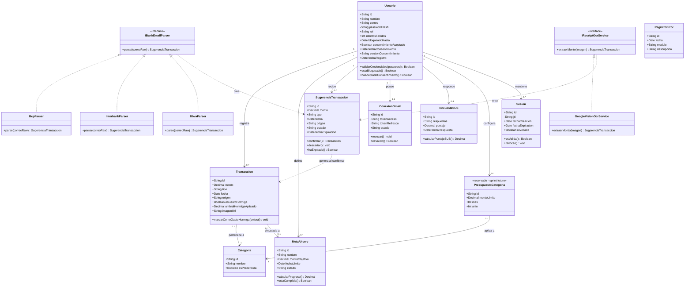

# DIAGRAMA DE CLASES — MODELO DE DOMINIO

## Código del diagrama

---

## ENTIDADES PRINCIPALES

| Clase | Rol en el sistema | HU/UC relacionada |
|:--|:--|:--|
| **Usuario** | Estudiante o investigador; punto de partida de casi todas las relaciones. Incluye el estado de bloqueo por intentos fallidos y la aceptación del consentimiento informado | AUT-01, AUT-02, CON-01 |
| **Sesion** | Sesión activa asociada a un JWT propio (`jti`); permite revocar el token en logout sin esperar su expiración | AUT-02 |
| **Transaccion** | Registro financiero confirmado (ingreso o egreso). Guarda el umbral de gasto hormiga aplicado al evaluarla, para reproducibilidad | TRX-01, TRX-02, CAT-02 |
| **Categoria** | Clasificación de un gasto (comida, transporte, etc.) | CAT-01 |
| **MetaAhorro** | Objetivo de ahorro con monto y fecha límite | AHO-01, AHO-02 |
| **SugerenciaTransaccion** | Transacción aún no confirmada, generada por OCR o Gmail | CNF-01 |
| **ConexionGmail** | Vínculo OAuth entre el usuario y su cuenta de Gmail | GML-01 |
| **IBankEmailParser** + implementaciones | Extraen datos de un correo bancario según el formato de cada banco | GML-02 |
| **IReceiptOcrService** + implementación | Extrae el monto de una imagen de boleta | OCR-01 |
| **EncuestaSUS** | Almacena las respuestas y el puntaje de usabilidad | USA-01 |
| **RegistroError** | Bitácora de errores funcionales del sistema | CAL-01 |
| **PresupuestoCategoria** | Reservada para el sprint de "si sobra tiempo" (aún no implementada) | — |

---

## POR QUÉ ESTE DISEÑO APLICA SOLID

**Open/Closed (O), visible dos veces en el mismo diagrama:**
- `IBankEmailParser` es una interfaz; `BcpParser`, `InterbankParser` y `BbvaParser` la implementan. Agregar un banco nuevo (ej. Scotiabank) significa crear una clase nueva, **sin tocar ninguna existente**.
- Exactamente el mismo patrón se repite con `IReceiptOcrService` → `GoogleVisionOcrService`. Si algún día cambias de proveedor de OCR (ej. a AWS Textract), solo agregas una clase nueva que implemente la interfaz — el resto del sistema no se entera del cambio.

**Single Responsibility (S):**
- `SugerenciaTransaccion` no sabe de dónde vino el dato (OCR o Gmail) en términos de lógica — solo sabe confirmarse, descartarse o expirar. Quien sabe "de dónde vino" es el parser/servicio que la creó.
- `MetaAhorro` calcula su propio progreso; no depende de que otra clase le diga el porcentaje.

**Dependency Inversion (D), anticipada aquí, formalizada en el Diagrama de Componentes:**
- Tanto `IBankEmailParser` como `IReceiptOcrService` son abstracciones de las que dependen las capas superiores (casos de uso) — nunca se referencia directamente a "Google Vision" o "BCP" desde la lógica de negocio, solo la interfaz.

---

## RELACIONES CLAVE EXPLICADAS

- **Transaccion → MetaAhorro (0..1):** una transacción puede o no estar vinculada a una meta de ahorro — de ahí que la multiplicidad sea opcional. Esto es lo que dispara el recálculo de progreso (UC-AHO-02) cuando corresponde.
- **SugerenciaTransaccion ..> Transaccion (dependencia "genera al confirmar"):** no es una asociación permanente porque, una vez confirmada, la sugerencia deja de existir — se convierte en una Transaccion real. Es una relación de transformación, no de posesión.
- **PresupuestoCategoria** aparece con el estereotipo `<<reservado>>` porque, como acordamos, se diseña ahora en el modelo aunque se implemente después — así el esquema queda abierto a extensión sin retrabajo futuro.

---
