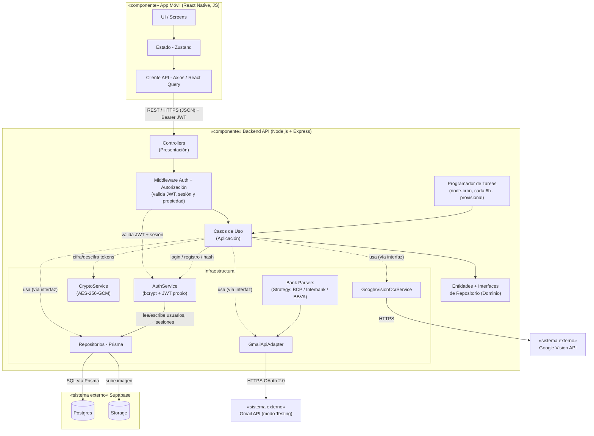

# DIAGRAMA DE COMPONENTES — ARQUITECTURA TÉCNICA

## Código del diagrama

---

## COMPONENTES Y SU RESPONSABILIDAD

| Componente | Tipo | Responsabilidad |
|:--|:--|:--|
| **App Móvil (React Native)** | Desplegable | Interfaz de usuario, gestión de estado local, comunicación HTTP con el backend |
| **Backend API (Node.js + Express)** | Desplegable | Toda la lógica de negocio, en 4 capas internas (Presentación, Aplicación, Dominio, Infraestructura) |
| **Controllers** | Interno (Presentación) | Reciben peticiones HTTP, delegan al caso de uso correspondiente |
| **Middleware Auth + Autorización** | Interno (Presentación) | Valida el JWT y el estado de la sesión en cada petición protegida (RF-51) y verifica la propiedad del recurso antes de ejecutar el caso de uso (RF-50, prevención de IDOR) |
| **Casos de Uso** | Interno (Aplicación) | Orquestan la lógica: qué hacer, en qué orden, con qué reglas |
| **Entidades + Interfaces de Repositorio** | Interno (Dominio) | El "qué es" del negocio — reglas puras, sin dependencias externas |
| **Repositorios (Prisma), Adaptadores, Parsers** | Interno (Infraestructura) | El "cómo" técnico — implementan las interfaces del dominio contra Postgres, Google Vision y Gmail |
| **AuthService** | Interno (Infraestructura) | Hashea y verifica contraseñas con bcrypt, emite y valida el JWT propio, y gestiona el ciclo de vida de las sesiones (creación, revocación) |
| **CryptoService** | Interno (Infraestructura) | Cifra y descifra los tokens de Gmail con AES-256-GCM antes de persistirlos / al usarlos |
| **Programador de Tareas (Cron)** | Interno *(provisional)* | Dispara `ImportBankEmailUseCase` cada 6 horas, sin intervención del estudiante. Ver nota de decisión temporal más abajo |
| **Supabase** | Sistema externo gestionado | Postgres (datos) y Storage (imágenes de boletas). **La autenticación NO se delega a Supabase Auth**: es propia del backend |
| **Google Vision API** | Sistema externo | Reconocimiento óptico de caracteres (OCR) |
| **Gmail API** | Sistema externo | Lectura de notificaciones bancarias vía OAuth 2.0 (app en **modo Testing** durante la construcción) |

---

## DECISIÓN DE DISEÑO: AUTENTICACIÓN PROPIA EN EL BACKEND

La autenticación **no** se delega a Supabase Auth; se implementa dentro del backend, en la capa de infraestructura (`AuthService`). Razón: los requisitos RF-06 (JWT de 7 días), RF-07 (bloqueo tras 5 intentos) y RF-08 (invalidación del token en logout) describen comportamiento personalizado que Supabase Auth no ofrece de forma nativa. Mantener toda la lógica de autenticación en un único lugar:

1. Elimina la "autenticación dividida" (cliente ↔ Supabase Auth + backend ↔ validación), que era una fuente de acoplamiento difícil de justificar en una arquitectura en capas.
2. Hace explícita y auditable la lógica de seguridad — ventaja directa para el capítulo de seguridad de la tesis.
3. Deja Supabase como lo que realmente se usa: **Postgres + Storage**.

**Flujo:** la app envía credenciales por HTTPS → `AuthService` verifica con bcrypt → emite un JWT (con `jti`) y registra la sesión en la tabla `sesiones`. En cada petición protegida, el `Middleware Auth` valida la firma del JWT y confirma que la sesión (`jti`) exista, no esté revocada ni expirada, y luego verifica la propiedad del recurso antes de delegar al caso de uso.

---

## DECISIONES TEMPORALES (con plan de migración)

Estas dos decisiones son deliberadas para la **fase de construcción** y están planificadas para migrar en la fase de ejecución (pretest/postest). Se documentan aquí para dejar constancia de que son elecciones conscientes, no limitaciones no advertidas.

| Decisión | Estado en construcción | Plan para la fase de ejecución |
|:--|:--|:--|
| **Gmail API en modo Testing** | La app OAuth opera en modo Testing de Google Cloud. Limitación conocida: el refresh token expira cada 7 días y exige reconexión. | Antes del piloto se evaluará verificar/publicar la app (o adquirir el servicio correspondiente) para eliminar la expiración semanal. Mientras tanto, Gmail es un **acelerador recortable**: el núcleo de medición no depende de él. El flujo FE1 de UC-GML-02 ya contempla la reconexión guiada cuando el token muere. |
| **Cron in-process (`node-cron`) en Render** | La búsqueda periódica cada 6 h corre dentro del proceso web. Limitación conocida: en el free tier de Render, si el servicio se suspende por inactividad, el disparo puede no ejecutarse. | Migrar a un disparador externo robusto (Render Cron Job dedicado, GitHub Actions programado que golpea un endpoint protegido, o `pg_cron` de Supabase) cuando se pase a la operación real del piloto. |

---
