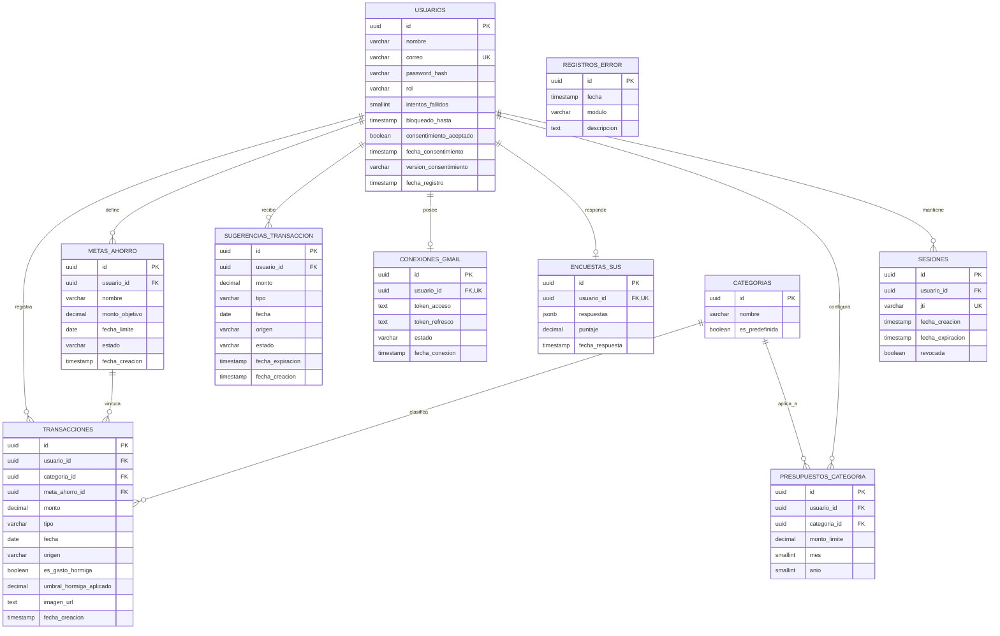

# DIAGRAMA ENTIDAD-RELACIÓN — BASE DE DATOS (POSTGRES / SUPABASE)

> **Nota de alcance:** las interfaces `IBankEmailParser` e `IReceiptOcrService` del Diagrama de Clases **no aparecen aquí** — son clases de comportamiento (lógica), no entidades de datos. Solo se persiste lo que es información, no el código que la procesa.

## Código del diagrama

---

## DICCIONARIO DE DATOS

### USUARIOS
| Columna | Tipo | Restricción |
|:--|:--|:--|
| id | UUID | PK |
| nombre | VARCHAR(150) | NOT NULL |
| correo | VARCHAR(150) | UNIQUE, NOT NULL |
| password_hash | VARCHAR(255) | NOT NULL — hash **bcrypt (cost 12)**, nunca texto plano |
| rol | VARCHAR(20) | NOT NULL, CHECK IN ('estudiante','investigador') |
| intentos_fallidos | SMALLINT | NOT NULL, DEFAULT 0 — soporte de RF-07 (bloqueo tras 5 intentos) |
| bloqueado_hasta | TIMESTAMP | NULLABLE — si tiene valor futuro, el login está temporalmente bloqueado |
| consentimiento_aceptado | BOOLEAN | NOT NULL, DEFAULT false — RF-47 a RF-49 (CON-01) |
| fecha_consentimiento | TIMESTAMP | NULLABLE — fecha de aceptación del consentimiento informado |
| version_consentimiento | VARCHAR(20) | NULLABLE — versión del texto aceptado, para trazabilidad ética |
| fecha_registro | TIMESTAMP | NOT NULL, DEFAULT now() |

### SESIONES
| Columna | Tipo | Restricción |
|:--|:--|:--|
| id | UUID | PK |
| usuario_id | UUID | FK → usuarios.id, NOT NULL |
| jti | VARCHAR(64) | UNIQUE, NOT NULL — identificador del JWT (JWT ID); permite revocar la sesión sin depender de la expiración del token |
| fecha_creacion | TIMESTAMP | NOT NULL, DEFAULT now() |
| fecha_expiracion | TIMESTAMP | NOT NULL — 7 días desde la creación (RF-06) |
| revocada | BOOLEAN | NOT NULL, DEFAULT false — se marca true en logout (RF-08) |

**Rol de esta tabla:** habilita autenticación propia con JWT *revocable*. En cada petición protegida, el backend valida la firma del JWT y luego verifica en `sesiones` que el `jti` exista, no esté `revocada` y no haya expirado (RF-51). Así se cumple RF-08 (logout real) sin renunciar a JWT.

### TRANSACCIONES
| Columna | Tipo | Restricción |
|:--|:--|:--|
| id | UUID | PK |
| usuario_id | UUID | FK → usuarios.id, NOT NULL |
| categoria_id | UUID | FK → categorias.id, NOT NULL |
| meta_ahorro_id | UUID | FK → metas_ahorro.id, **NULLABLE** |
| monto | DECIMAL(10,2) | NOT NULL, CHECK (monto > 0) |
| tipo | VARCHAR(10) | NOT NULL, CHECK IN ('ingreso','egreso') |
| fecha | DATE | NOT NULL, CHECK (fecha <= CURRENT_DATE) |
| origen | VARCHAR(10) | NOT NULL, DEFAULT 'manual', CHECK IN ('manual','ocr','gmail') |
| es_gasto_hormiga | BOOLEAN | NOT NULL, DEFAULT false |
| umbral_hormiga_aplicado | DECIMAL(10,2) | NULLABLE — snapshot del umbral con el que se evaluó el egreso (RF-38); NULL para ingresos |
| imagen_url | TEXT | NULLABLE |
| fecha_creacion | TIMESTAMP | NOT NULL, DEFAULT now() |

### CATEGORIAS
| Columna | Tipo | Restricción |
|:--|:--|:--|
| id | UUID | PK |
| nombre | VARCHAR(50) | NOT NULL |
| es_predefinida | BOOLEAN | NOT NULL, DEFAULT true |

### METAS_AHORRO
| Columna | Tipo | Restricción |
|:--|:--|:--|
| id | UUID | PK |
| usuario_id | UUID | FK → usuarios.id, NOT NULL |
| nombre | VARCHAR(100) | NOT NULL |
| monto_objetivo | DECIMAL(10,2) | NOT NULL, CHECK (monto_objetivo > 0) |
| fecha_limite | DATE | NOT NULL, CHECK (fecha_limite > CURRENT_DATE al crear) |
| estado | VARCHAR(20) | NOT NULL, DEFAULT 'activa', CHECK IN ('activa','cumplida','inactiva') |
| fecha_creacion | TIMESTAMP | NOT NULL, DEFAULT now() |

### SUGERENCIAS_TRANSACCION
| Columna | Tipo | Restricción |
|:--|:--|:--|
| id | UUID | PK |
| usuario_id | UUID | FK → usuarios.id, NOT NULL |
| monto | DECIMAL(10,2) | NOT NULL |
| tipo | VARCHAR(10) | NOT NULL, CHECK IN ('ingreso','egreso') |
| fecha | DATE | NOT NULL |
| origen | VARCHAR(10) | NOT NULL, CHECK IN ('ocr','gmail') |
| estado | VARCHAR(20) | NOT NULL, DEFAULT 'pendiente', CHECK IN ('pendiente','confirmada','descartada') |
| fecha_expiracion | TIMESTAMP | NOT NULL |
| fecha_creacion | TIMESTAMP | NOT NULL, DEFAULT now() |

### CONEXIONES_GMAIL
| Columna | Tipo | Restricción |
|:--|:--|:--|
| id | UUID | PK |
| usuario_id | UUID | FK → usuarios.id, **UNIQUE**, NOT NULL |
| token_acceso | TEXT | NOT NULL — cifrado con **AES-256-GCM** a nivel de aplicación antes de guardar (RF-24) |
| token_refresco | TEXT | NOT NULL — cifrado con **AES-256-GCM** (RF-24) |
| estado | VARCHAR(20) | NOT NULL, DEFAULT 'activo', CHECK IN ('activo','revocado') |
| fecha_conexion | TIMESTAMP | NOT NULL, DEFAULT now() |

### ENCUESTAS_SUS
| Columna | Tipo | Restricción |
|:--|:--|:--|
| id | UUID | PK |
| usuario_id | UUID | FK → usuarios.id, **UNIQUE**, NOT NULL |
| respuestas | JSONB | NOT NULL |
| puntaje | DECIMAL(5,2) | NOT NULL, CHECK (puntaje BETWEEN 0 AND 100) |
| fecha_respuesta | TIMESTAMP | NOT NULL, DEFAULT now() |

### REGISTROS_ERROR
| Columna | Tipo | Restricción |
|:--|:--|:--|
| id | UUID | PK |
| fecha | TIMESTAMP | NOT NULL, DEFAULT now() |
| modulo | VARCHAR(50) | NOT NULL |
| descripcion | TEXT | NOT NULL |

**Sin llave foránea a usuarios, por diseño** — regla de privacidad definida en la HU CAL-01: el registro de errores nunca debe poder rastrearse hasta un estudiante específico.

### PRESUPUESTOS_CATEGORIA *(reservada — sprint futuro)*
| Columna | Tipo | Restricción |
|:--|:--|:--|
| id | UUID | PK |
| usuario_id | UUID | FK → usuarios.id, NOT NULL |
| categoria_id | UUID | FK → categorias.id, NOT NULL |
| monto_limite | DECIMAL(10,2) | NOT NULL, CHECK (monto_limite > 0) |
| mes | SMALLINT | NOT NULL, CHECK (mes BETWEEN 1 AND 12) |
| anio | SMALLINT | NOT NULL |

---

## POR QUÉ ESTÁ EN 3FN (TERCERA FORMA NORMAL)

- **1FN:** todos los campos son atómicos (ej. `tipo` es un solo valor, no una lista de valores separados por coma).
- **2FN:** no hay tablas con llave primaria compuesta, así que no hay dependencias parciales posibles.
- **3FN:** ningún atributo no clave depende de otro atributo no clave. Por ejemplo, `es_gasto_hormiga` depende directamente de `monto` (vía lógica de aplicación, no de otra columna de la misma fila), y `categoria_id` es una referencia, no una copia del nombre de la categoría — evita duplicar `nombre` de categoría en cada transacción.

---

## ÍNDICES RECOMENDADOS (para las consultas que alimentan tus indicadores)

| Índice | Por qué |
|:--|:--|
| `transacciones(usuario_id, fecha)` | Acelera el cálculo de "N.º de registros por semana" y los filtros del dashboard por periodo |
| `transacciones(meta_ahorro_id)` | Acelera el cálculo de progreso de ahorro (UC-AHO-02), que se ejecuta en tiempo real |
| `sugerencias_transaccion(usuario_id, estado)` | Acelera la consulta de sugerencias pendientes (UC-CNF-01) |
| `usuarios(correo)` | Ya cubierto por el UNIQUE constraint, pero conviene confirmarlo como índice explícito para el login |
| `sesiones(jti)` | Ya cubierto por el UNIQUE, pero es el índice que se golpea en **cada petición protegida** al validar la sesión — debe existir sí o sí |
| `sesiones(usuario_id, revocada)` | Acelera la revocación de todas las sesiones de un usuario y la limpieza de sesiones expiradas |

---

## RELACIONES CLAVE EXPLICADAS

- **`transacciones.meta_ahorro_id` es NULLABLE**: no toda transacción está vinculada a una meta de ahorro — es opcional por diseño, coherente con el `0..1` del diagrama de clases.
- **`conexiones_gmail.usuario_id` y `encuestas_sus.usuario_id` son UNIQUE**: modelan la relación uno-a-uno (o uno-a-cero-o-uno) — un estudiante tiene como máximo una conexión de Gmail y responde la encuesta SUS una sola vez, reforzando a nivel de base de datos la regla de negocio ya definida en las HU (GML-01 y USA-01).
- **`registros_error` no tiene FK a usuarios**: es intencional, no un olvido — está explicado arriba.

---
