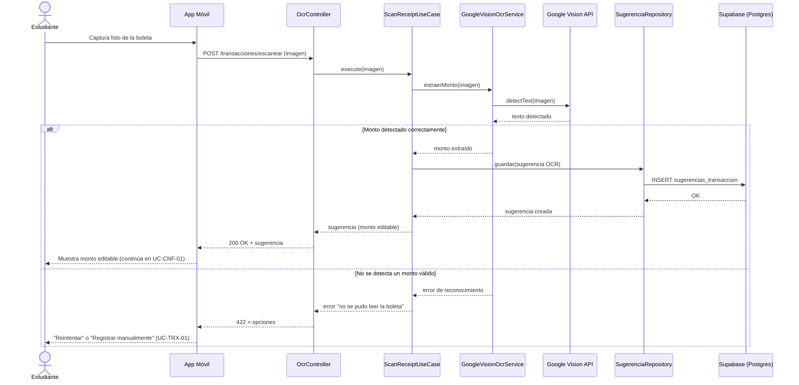
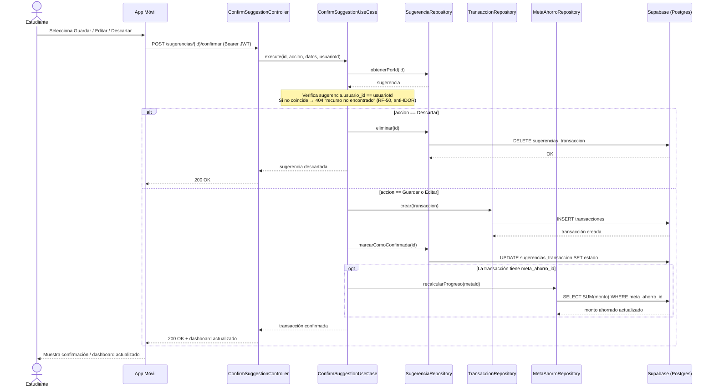
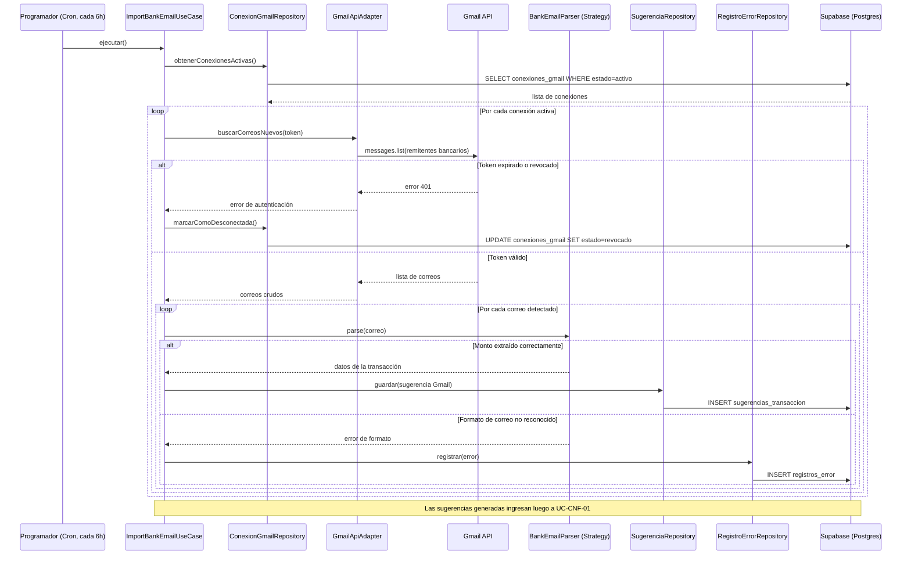
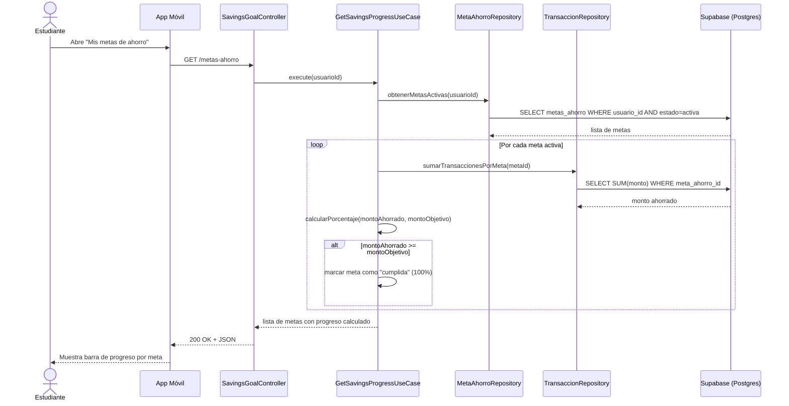
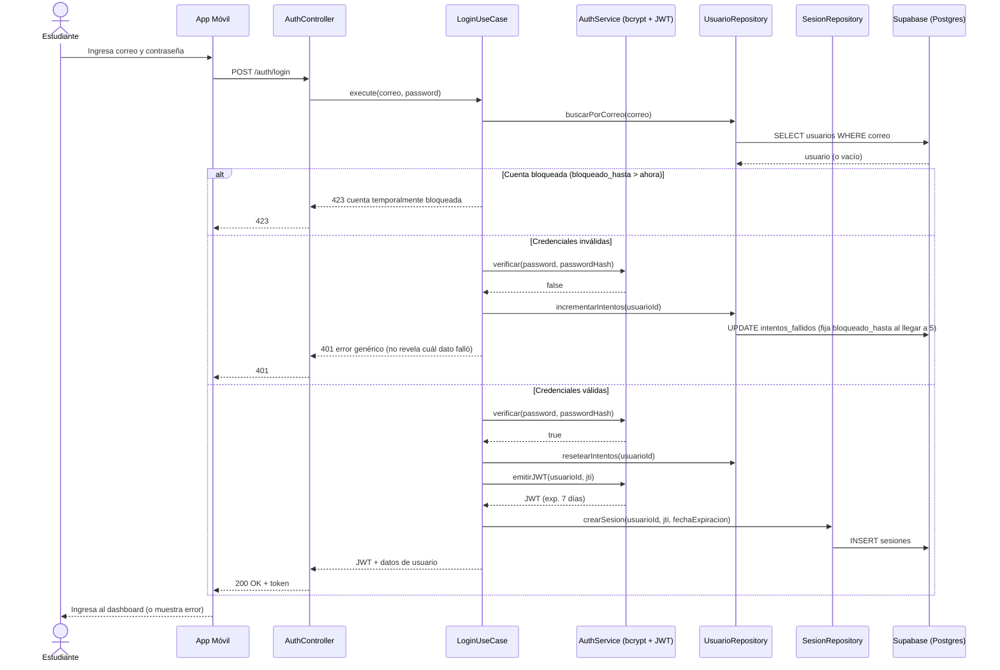

# DIAGRAMAS DE SECUENCIA — CASOS DE USO CRÍTICOS
---

## 1. UC-OCR-01 — Escanear boleta con OCR

**Qué observar:** `OcrController` nunca llama directamente a `Vision`; siempre pasa por `ScanReceiptUseCase`, que a su vez pasa por la interfaz `GoogleVisionOcrService`. Si mañana cambias de proveedor de OCR, este diagrama de secuencia no cambia — solo cambia qué clase concreta implementa la interfaz.

---

## 2. UC-CNF-01 — Confirmar transacción detectada

**Qué observar:** este es el diagrama que conecta CNF-01 con AHO-02 — el bloque `opt` muestra exactamente el momento en que confirmar una transacción dispara, condicionalmente, el recálculo del progreso de ahorro. Es la "cascada" que mencioné cuando cerramos la especificación de casos de uso. La `Note` inicial hace explícita la **verificación de propiedad** (RF-50): el caso de uso nunca opera sobre una sugerencia ajena al usuario del token, y responde 404 en vez de 403 para no revelar que el recurso existe.

---

## 3. UC-GML-02 — Importar transacción desde correo bancario

**Qué observar:** `Parser` aparece como un solo participante genérico ("BankEmailParser (Strategy)") aunque en el código son 3 clases distintas (BcpParser, InterbankParser, BbvaParser) — es intencional: el diagrama de secuencia muestra el *contrato* que usa `ImportBankEmailUseCase`, no cuál implementación concreta se ejecuta en cada caso. Eso es Dependency Inversion en la práctica: la secuencia no cambia sin importar qué banco sea.

---

## 4. UC-AHO-02 — Ver progreso de ahorro

**Qué observar:** no hay ningún paso de "guardar el porcentaje" — se recalcula siempre desde `SUM(monto)`, tal como quedó definido como requisito especial en la especificación de este caso de uso. El diagrama confirma que el diseño es consistente con esa decisión. Además, todas las consultas están **acotadas por `usuario_id`** (el del token), de modo que el control de acceso (RF-50) queda garantizado por construcción: un estudiante nunca puede leer metas de otro.

---

## 5. UC-AUT-02 — Iniciar sesión (autenticación propia)

**Qué observar:** la autenticación es **propia del backend**, no de Supabase Auth. Tres detalles cierran los requisitos de seguridad: (1) el mensaje de error es **genérico** (CA02 de AUT-02) — no dice si falló el correo o la contraseña; (2) el bloqueo por 5 intentos (RF-07) se persiste en `usuarios.intentos_fallidos` / `bloqueado_hasta`; (3) cada login crea una fila en `sesiones` con un `jti`, lo que permite el **logout real** (RF-08): al cerrar sesión se marca `revocada=true`, y en cada petición posterior el middleware rechaza cualquier JWT cuyo `jti` esté revocado o expirado (RF-51), aunque la firma siga siendo válida.

---

## RESUMEN DE TRAZABILIDAD

| Diagrama | Caso de uso | Casos de uso conectados |
|:--|:--|:--|
| 1 | UC-OCR-01 | Termina en UC-CNF-01 |
| 2 | UC-CNF-01 | Recibido desde UC-OCR-01 y UC-GML-02; dispara UC-AHO-02 (condicional); verifica propiedad (RF-50) |
| 3 | UC-GML-02 | Termina en UC-CNF-01; registra fallos en UC-CAL-01 |
| 4 | UC-AHO-02 | Disparado por UC-CNF-01 y por UC-TRX-02 (edición/eliminación); consultas acotadas por usuario (RF-50) |
| 5 | UC-AUT-02 | Base de toda sesión; habilita la validación de token del resto de casos de uso (RF-51) |
